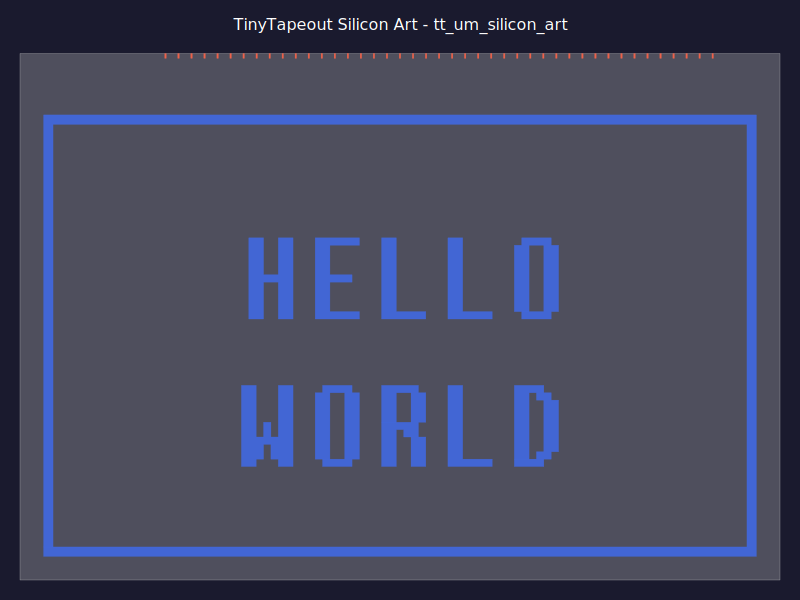

# TinyTapeout Silicon Art - Text on a Chip

[](https://github.com/YOUR_USERNAME/YOUR_REPO/actions/workflows/gds.yaml)

> Put a book on a chip! Create silicon art with text visible under a microscope.


## Overview

This project demonstrates how to create **silicon art** using [TinyTapeout](https://tinytapeout.com/) - putting text, characters, or even entire books onto a silicon wafer that can be viewed under a microscope.




### What You'll Get

- Text rendered as metal polygons on silicon
- Characters approximately 5-15 micrometers tall (depending on tile size)
- Visible under an optical microscope at 50-500x magnification
- A real fabricated chip with your art!

## Project Structure

```
├── src/
│   ├── project.v           # Minimal Verilog design (required by TinyTapeout)
│   ├── config.json         # OpenLane configuration
│   ├── text_to_gds.py      # Generate standalone text GDS
│   └── add_text_to_gds.py  # Add text to existing GDS (post-process)
├── test/
│   ├── test.py             # Cocotb testbench
│   └── Makefile
├── docs/
│   └── info.md             # Project documentation
├── .github/workflows/
│   ├── gds.yaml            # Build GDS + viewer
│   ├── test.yaml           # Run tests
│   └── docs.yaml           # Build docs
├── info.yaml               # TinyTapeout project info
└── README.md
```

## How It Works

### The Strategy

TinyTapeout uses the OpenLane flow to synthesize Verilog into a GDS (GDSII) file - the format used for chip fabrication. The GDS contains multiple layers representing different materials on the silicon.

For silicon art, we:
1. Create a minimal valid Verilog design (required for TinyTapeout submission)
2. Generate text as polygons on metal layers
3. These metal layers are physically created during fabrication
4. The metal patterns are visible under a microscope!

### Metal Layers (Sky130 PDK)

| Layer | GDS # | Notes |
|-------|-------|-------|
| met1  | 68:20 | Closest to silicon, most visible |
| met2  | 69:20 | Good visibility |
| met3  | 70:20 | Good visibility |
| met4  | 71:20 | Top layer available in TinyTapeout |
| li1   | 67:20 | Local interconnect |

### Tile Sizes

TinyTapeout offers different tile sizes. Dimensions vary by PDK:

**IHP-SG13G2 PDK:**
| Size | Dimensions | Approximate Text Capacity |
|------|------------|---------------------------|
| 1x1  | 202 × 155 µm | ~25 characters |
| 1x2  | 202 × 314 µm | ~60 characters |
| 2x2  | 420 × 314 µm | ~120 characters |

**Sky130 PDK:**
| Size | Dimensions | Approximate Text Capacity |
|------|------------|---------------------------|
| 1x1  | 161 × 112 µm | ~20 characters |
| 1x2  | 161 × 226 µm | ~50 characters |
| 2x2  | 335 × 226 µm | ~100 characters |

## Quick Start

### 1. Generate a "Hello World!" GDS

```bash
# Install dependencies
pip install gdstk

# Generate Hello World GDS
cd src
python text_to_gds.py --hello-world

# Or custom text
python text_to_gds.py "Hello\nWorld!" hello.gds
```

### 2. View the GDS

After pushing to GitHub, the GDS viewer will be available at:
```
https://YOUR_USERNAME.github.io/YOUR_REPO/
```

Or locally with KLayout:
```bash
pip install klayout
klayout text_art.gds
```

### 3. Customize Your Text

```bash
# Simple text
python text_to_gds.py "Your Name" name.gds

# Multi-line
python text_to_gds.py "Line 1\nLine 2\nLine 3" multiline.gds

# Larger tile for more text
python text_to_gds.py --tile-size 2x2 "More space!" large.gds

# From a file (for books/long text)
python text_to_gds.py --tile-size 8x2 --from-file book.txt book.gds

# Different metal layer
python text_to_gds.py --layer met2 "On Metal 2" met2.gds

# Custom font size (in micrometers)
python text_to_gds.py --font-size 3.0 "Tiny Text" tiny.gds
```

### 4. Add Text to Existing Design

If you have a GDS from OpenLane and want to add art:

```bash
python add_text_to_gds.py runs/wokwi/results/final/gds/tt_um_example.gds \
    output.gds "Hello World!" --layer met4
```

## For TinyTapeout Submission

### Method 1: Standalone Art (Recommended for Pure Art)

1. Fork this repository
2. Modify `src/text_to_gds.py` to generate your desired text
3. Update `info.yaml` with your project details
4. Push to GitHub - the Actions will build everything
5. Submit to TinyTapeout

### Method 2: Art + Functional Design

1. Create your functional Verilog design in `src/project.v`
2. After the GDS is built, use `add_text_to_gds.py` to add art
3. The text will be added to an upper metal layer (met4)

### Method 3: Custom Macro Integration

For advanced users, you can integrate the text GDS as a macro:

1. Generate text GDS with `text_to_gds.py`
2. Modify OpenLane config to include it as `EXTRA_GDS_FILES`
3. This merges the art directly into the build

## Viewing Your Chip

Once fabricated, you can view your silicon art with:

- **Optical Microscope**: 50-500x magnification
  - Metallurgical/reflected light microscope works best
  - Dark field illumination enhances metal visibility
  
- **Electron Microscope**: For ultimate detail
  - SEM (Scanning Electron Microscope) for surface detail
  - University labs often have access

### What to Expect

The metal layers appear as:
- **Bright/reflective** areas under optical microscope
- Different metal layers have slightly different colors
- Text will be approximately 5-20 µm tall depending on settings

### Fill Blockage for Better Visibility

By default, the TinyTapeout flow adds **metal fill** to meet density requirements. This fill can obscure your art when viewing under a microscope.

**Solution: Use `.nofill` layers to block fill above your art!**

```bash
# Generate GDS with fill blockage (default - blocks Metal4/5/TopMetal1)
python create_pixel_pig.py --output gds

# Block fill on ALL metal layers (including Metal1-3)
python create_pixel_pig.py --block-all-metals --output gds

# Disable fill blockage (if precheck rejects nofill layers)
python create_pixel_pig.py --no-fill-blockage --output gds
```

**How it works:**
- The IHP-SG13G2 PDK has `.nofill` layers (datatype 22) for each metal layer
- Adding shapes to these layers tells OpenLane's fill insertion to skip those regions
- The art is on Metal1-3, so we block fill on Metal4, Metal5, and TopMetal1 above it

**Important caveats:**
1. Fill blockage shapes must NOT overlap with power rails (automated in the script)
2. The `.nofill` layers (e.g., Metal4.nofill = 50/22) may not be in TinyTapeout's precheck whitelist
3. If precheck fails with "Invalid layers in GDS", contact TinyTapeout or use `--no-fill-blockage`

| Layer | Nofill Layer | GDS |
|-------|-------------|-----|
| Metal1 | Metal1.nofill | 8/22 |
| Metal4 | Metal4.nofill | 50/22 |
| Metal5 | Metal5.nofill | 67/22 |
| TopMetal1 | TopMetal1.nofill | 126/22 |

## Putting a Book on a Chip

Yes, you can put actual book content on silicon! Here's how:

```bash
# Prepare your text file
echo "It was the best of times..." > excerpt.txt

# Generate with largest tile size
python text_to_gds.py --tile-size 8x2 --from-file excerpt.txt book.gds
```

**Capacity estimates** (approximate, depends on font size):
- 1x1 tile: ~50-100 bytes of text
- 8x2 tile: ~1-2 KB of text

For larger texts, consider:
- Multiple tiles
- Smaller font sizes (minimum ~1-2 µm)
- Abbreviations or encoding schemes

## Technical Details

### GDS Generation

The `text_to_gds.py` script uses [gdstk](https://heitzmann.github.io/gdstk/) to:
1. Render text using a built-in font
2. Convert characters to polygon paths
3. Place polygons on the specified metal layer
4. Output a GDSII file

### Font Characteristics

- Aspect ratio: 1:2 (width:height)
- Character spacing: 9/16 × font_size
- Line spacing: 5/4 × font_size
- Minimum recommended size: 2 µm

### DRC Considerations

**IHP-SG13G2 DRC Rules:**
- Metal1: min width 0.16µm, min space 0.18µm, density 35-60%
- Metal2-4: min width 0.20µm, min space 0.21µm, density 35-60%
- TopMetal1: min width 1.64µm, min space 1.64µm, density 25-70%

**⚠️ CRITICAL: TinyTapeout's layer whitelist limits silicon art options!**

The TinyTapeout precheck only allows specific layer/datatype combinations.
For IHP-SG13G2, `.filler` layers (datatype 22) are **NOT in the whitelist**.

| Layer | Allowed Datatypes | Fabricated? | DRC? |
|-------|-------------------|-------------|------|
| Metal1.drawing | 8/0 | ✅ Yes | ✅ Width/space |
| Metal1.pin | 8/2 | ✅ Yes | Pin only |
| Metal1.text | 8/25 | ❌ **No** | N/A |
| Metal1.filler | 8/22 | Would be... | **❌ NOT ALLOWED** |

**Practical approach for silicon art on IHP:**
1. **Pixel art works**: Use large rectangles (>0.20µm) on `.drawing` layers
2. **Fine text doesn't work**: gdstk.text() strokes often violate DRC
3. **Density is a concern**: Sparse art may fail 35-60% density requirement

This project uses **pixel art** (large rectangles) which meets DRC requirements.

## Resources

- [TinyTapeout](https://tinytapeout.com/) - Submit your design
- [TinyTapeout Discord](https://tinytapeout.com/discord) - Community support
- [Sky130 PDK](https://skywater-pdk.readthedocs.io/) - Process documentation
- [gdstk Documentation](https://heitzmann.github.io/gdstk/) - GDS library
- [KLayout](https://www.klayout.de/) - GDS viewer/editor

## Examples

### Simple Hello World
```python
from text_to_gds import SiliconTextGenerator

gen = SiliconTextGenerator(tile_size="1x1", layer="met1")
cell = gen.create_text_cell("Hello\nWorld!")
gen.add_border(cell)
gen.save("hello_world.gds")
```

### Custom Book Content
```python
gen = SiliconTextGenerator(tile_size="8x2", layer="met1")

text = """In the beginning
was the Word,
and the Word was
with God..."""

cell = gen.create_text_cell(text, font_size=8)
gen.add_border(cell, border_width=3)
gen.save("genesis.gds")
```

## Troubleshooting: Die Area Mismatch Error

### The Error
```
Die area mismatch: expected 202.08x154.98 µm (1x1 tiles), got 161x111.52 µm
```

### Root Cause
This project was originally written for **Sky130 PDK** but TinyTapeout shuttles may use **IHP-SG13G2 PDK** which has completely different tile dimensions:

| PDK | 1x1 Tile Size | Pin Y Position | Layer Name |
|-----|---------------|----------------|------------|
| Sky130 | 161.0 × 111.52 µm | 111.02 µm | `met4` (lowercase) |
| **IHP-SG13G2** | **202.08 × 154.98 µm** | **154.48 µm** | **`Metal4`** (capital M) |

### What Was Changed (Dec 2024)
To fix for IHP PDK:

1. **Die dimensions**: Updated from 161×111.52 to **202.08×154.98 µm**

2. **PIN_Y_CENTER**: Changed from 111.02 to **154.48 µm** (pins at top edge)

3. **All 43 signal pin X positions**: Completely different coordinates extracted from:
   `tt-support-tools/tech/ihp-sg13g2/def/tt_block_1x1_pgvdd.def`

4. **LEF layer name**: Changed from `met4` to `Metal4` (IHP uses capital M)

5. **GDS layer numbers**: Updated to IHP layer scheme

### How to Verify Your PDK
Check which PDK your TinyTapeout shuttle uses:
- Look at the error message dimensions
- Check `tt-support-tools/tech/<pdk>/tile_sizes.yaml` for your shuttle

### Key Files Modified
- `src/create_silicon_art.py` - Main generator with all dimensions/pins
- `src/validate_lef.py` - Local validator 
- `test/test_validate_lef.py` - Tests

### Reference: IHP Pin Positions
Signal pins are at Y=154.48µm (center). X positions from DEF:
- clk: 187.20, ena: 191.04, rst_n: 183.36
- ui_in[0-7]: 179.52 → 152.64 (step -3.84)
- uio_in[0-7]: 148.80 → 121.92
- uo_out[0-7]: 118.08 → 91.20
- uio_out[0-7]: 87.36 → 60.48
- uio_oe[0-7]: 56.64 → 29.76

## Troubleshooting: DRC and Layer Violations

### The Errors
```
ERROR: KLayout SG13G2 DRC ❌ Fail: Klayout sg13g2 failed with 45 DRC violations
ERROR: Layer check ❌ Fail: Invalid layers in GDS: {(30, 22), (10, 22), (8, 22)}
```

### Root Causes

1. **Invalid layers**: TinyTapeout's precheck whitelist doesn't include `.filler` layers (datatype 22)
2. **DRC violations**: Fine text strokes from gdstk.text() violate min width rules
3. **DBU precision**: Floating-point issues with GDS database unit

### The Reality of IHP Silicon Art

**TinyTapeout's layer whitelist is restrictive.** For IHP-SG13G2:

| Layer | Allowed? | Fabricated? | Notes |
|-------|----------|-------------|-------|
| Metal1.drawing (8/0) | ✅ Yes | ✅ Yes | DRC checked (width/space) |
| Metal1.pin (8/2) | ✅ Yes | ✅ Yes | For pins only |
| Metal1.text (8/25) | ✅ Yes | ❌ **No** | Documentation only |
| Metal1.filler (8/22) | ❌ **No** | Would be... | **Not in whitelist!** |

This means:
- **Pixel art is possible** using `.drawing` layers with DRC-compliant geometry
- **Fine text is difficult** because strokes often violate DRC rules
- **There's no "DRC-exempt" fabricated layer** in the TinyTapeout whitelist

### The Fix (Dec 2024)

**1. Use .drawing layers (datatype 0) - the only whitelisted fabricated layers:**
```python
# Valid and fabricated (but DRC checked)
TEXT_LAYER = 8      # Metal1
TEXT_DATATYPE = 0   # .drawing - TinyTapeout whitelisted
```

**2. Use pixel art instead of fine text:**
- Each pixel must be >= 0.20µm (max of all metal min widths)
- Pixels must be spaced >= 0.21µm apart
- The pixel pig design uses ~7.6µm pixels, easily passing DRC

**3. Fixed DBU precision:**
```python
lib = gdstk.Library(unit=1e-6, precision=1e-9)  # DBU = 0.001 exactly
```

### IHP Layer Reference (TinyTapeout Allowed)
| Layer Name | GDS | Purpose | Fabricated? |
|------------|-----|---------|-------------|
| Metal1.drawing | 8/0 | Art + routing | ✅ Yes (DRC checked) |
| Metal1.pin | 8/2 | Pins | ✅ Yes |
| Metal1.text | 8/25 | Documentation | ❌ No |
| Metal4.pin | 50/2 | Signal pins | ✅ Yes |
| TopMetal1.pin | 126/2 | Power pins | ✅ Yes |
| prBoundary | 189/4 | Die boundary | N/A |

### Key Insight
**For TinyTapeout IHP, silicon art must use `.drawing` layers and meet DRC rules.**
This limits options to:
- Pixel art with large (>0.2µm) rectangles ✅
- Large text with thick (>2µm) strokes ✅
- Fine detailed text ❌ (violates DRC)

## Troubleshooting: LVS Pin Name Errors

### The Error
```
librelane.flows.flow.FlowError: One or more deferred errors were encountered:
52 LVS errors found.
```

With warnings in the extraction log:
```
[!] Pin without name ignored !
[!] Pin without name ignored !
... (repeated 45 times)
```

And in the LVS report, pins appear with `proxy` prefix:
```
proxyuo_out[0]     |uo_out[0]
proxyVPWR          |VPWR
proxyVGND          |VGND
```

### Root Cause

**Pin labels are on the wrong GDS layer!** The SPICE extraction tool (used for LVS) only recognizes pin names on `.text` layers (datatype 25), NOT `.label` layers (datatype 1).

| Layer | Datatype 1 (.label) | Datatype 25 (.text) |
|-------|---------------------|---------------------|
| Metal4 (50) | ❌ Not recognized | ✅ Used for signal pin names |
| TopMetal1 (126) | ❌ Not recognized | ✅ Used for power pin names |

When pin labels are on datatype 1, the extraction tool finds the pin shapes but can't find their names, causing:
1. "Pin without name ignored" warnings
2. All macro pins become undefined in the SPICE netlist
3. LVS creates dummy `proxy*` net names for wires to the missing pins
4. 52 LVS errors due to pin mismatches

### The Fix (Dec 2024)

**Changed label datatype from 1 to 25 in GDS generation:**

```python
# WRONG - extraction tool ignores these
LABEL_DATATYPE = 1          # .label datatype (not recognized!)
POWER_LABEL_DATATYPE = 1    # .label datatype (not recognized!)

# CORRECT - extraction tool finds pin names
LABEL_DATATYPE = 25         # .text datatype ✅
POWER_LABEL_DATATYPE = 25   # .text datatype ✅
```

### How to Verify Your Pin Labels

```python
import gdstk
lib = gdstk.read_gds('your_design.gds')
cell = lib.cells[0]
for label in cell.labels:
    print(f'{label.text} at layer {label.layer}/{label.texttype}')
    
# Should show:
#   clk at layer 50/25 (Metal4.text) ✅
#   VPWR at layer 126/25 (TopMetal1.text) ✅
# NOT:
#   clk at layer 50/1 (Metal4.label) ❌
```

## License

Apache 2.0 - See [LICENSE](LICENSE)


## Acknowledgments

- [TinyTapeout](https://tinytapeout.com/) for making chip fabrication accessible
- [Efabless](https://efabless.com/) and [Google](https://developers.google.com/silicon) for the Sky130 shuttle program
- The open-source silicon community
